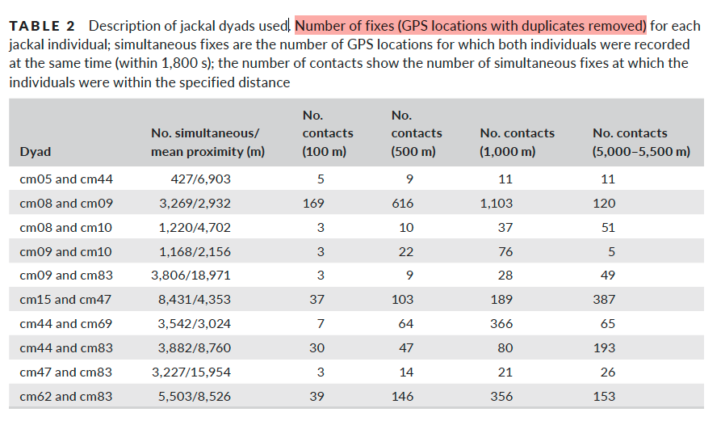
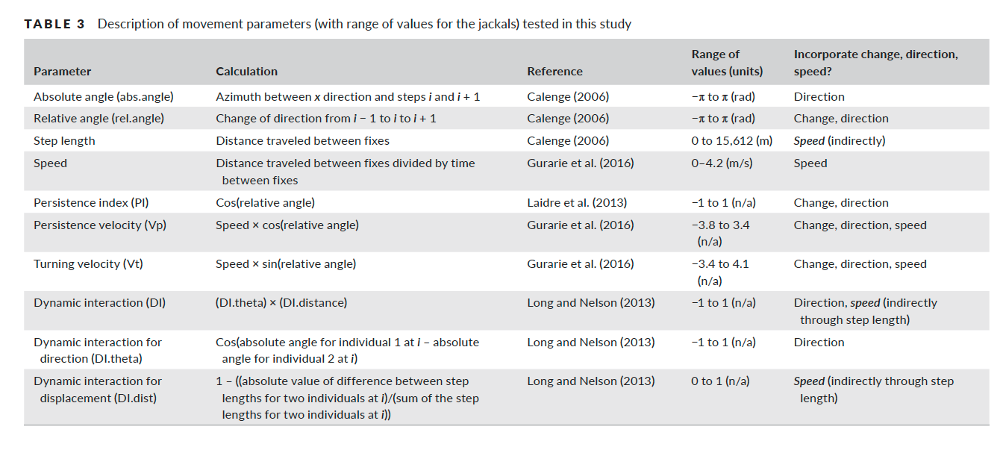
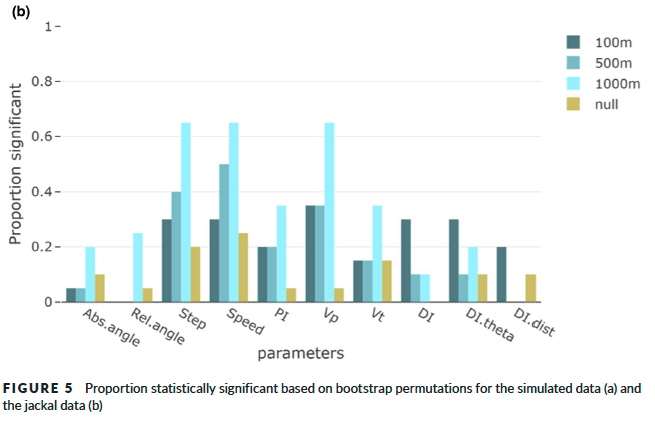

```{r setup, include=FALSE}
knitr::opts_chunk$set(echo = TRUE)
```

# Outline

**Goal of the Paper**

The paper "Exploring the utility of movement parameters to make
inferences about dynamic interactions in moving objects" by Jennifer A.
Miller (2021) investigates whether individual movement parameters change
when animals are in proximity to others. In particular, it explores how
more complex movement characteristics—such as persistence index (PI),
persistence velocity (Vp), and turning velocity (Vt)—may vary during
periods of potential interaction.

**Dataset**

Simulated Movement Data: Leader–follower dyads with known interaction
properties.

Real Movement Data: GPS tracking data from 10 black-backed jackals
(Canis mesomelas) in Etosha National Park, Namibia (2009–2010), sampled
at approximately 1 hour intervals.

**Analyses**

Movement Parameters Measured: Speed, step length, absolute and relative
angles, directional persistence (PI), persistence velocity (Vp), turning
velocity (Vt), and three dynamic interaction metrics (DI, DI.theta,
DI.dist).

Time Threshold: 1800 seconds (half of the time interval of data)

Distance Thresholds:

-   Simulated Movement Data: Proximity thresholds of 10 and 250 meters
    were used to classify movement into “contact” and “other.”

-   Real Movement Data: 100, 500, 1000, and 5000–5500 meters were used.

Statistical Tests:

-   Watson’s U² for angular variables (absolute and relative angles).

-   Kolmogorov–Smirnov for continuous variables (speed, step length, PI,
    Vp, Vt).

-   Wilcoxon rank-sum test for DI metrics (DI, DI.theta, DI.dist).

-   Bootstrap resampling (k = 1,000) to test the significance of
    observed statistics.

**Replicated parts**

-   Real jackal GPS data

-   Individual movement parameters (absolute and relative angles, speed,
    step length, PI, Vp, Vt)

-   Proximity-based interaction (“contact” vs “other”).

-   The bootstrap-based statistical comparison between movement
    parameters during “contact” and “other” situations for each dyad
    using Watson’s U² and Kolmogorov–Smirnov statistics.

# Data preprocessing

Load the data, filter relevant individuals and years, arrange by ID and
time, and remove duplicate records.

```{r}
library(tidyverse)
library(skimr)

# Read the CSV file (GPS tracking data for black-backed jackals)
d <- read_csv("./data/Black-backed jackal, Etosha National Park, Namibia.csv", col_names=TRUE)
head(d)
# Count total number of missing values in the dataset
sum(is.na(d))
# Check the unique values of the 'visible' column (to explore potential filtering criteria)
unique(d$visible)

# Filter the dataset:
# - Keep only data from years 2009 and 2010
# - Keep only individuals of interest (10 selected jackals)
# - Select relevant columns (timestamp, location (x,y), individual ID)
# - Sort the data by individual ID and timestamp for time-ordering
d <- d %>%
  filter(year(timestamp) >= 2009 & year(timestamp) <= 2010) %>% # filter 2009 & 2010
  filter(`individual-local-identifier` %in% c("CM05","CM08","CM09","CM10","CM15",
                                              "CM44","CM47","CM62","CM69","CM83")) %>%
  dplyr::select(timestamp,`location-long`,`location-lat`,`individual-local-identifier`) %>% 
  arrange(`individual-local-identifier`, timestamp)

# Remove duplicated GPS locations
d <- d %>%
  distinct(timestamp,`individual-local-identifier`, .keep_all = TRUE)

skim(d)
```

```{r}
# split the data by individual id (for later use)
d_list <- d %>% 
  group_split(`individual-local-identifier`) %>% 
  set_names(unique(d$`individual-local-identifier`))

d_list
```

# Visualization of GPS tracking data (10 jackals)

```{r}
library(ggplot2)

ggplot(d, aes(x = `location-long`, y = `location-lat`, group = `individual-local-identifier`, color = `individual-local-identifier`)) +
  geom_path(linewidth = 0.8, alpha = 0.2) +
  geom_point(size = 0.1, alpha = 0.2) +
  coord_fixed() +
  labs(title = "Black-backed Jackal Trajectories",
       x = "Longitude", y = "Latitude", color = "Jackals") +
  theme_minimal()
```

In the original paper, the visualization is presented as follows.

```{r, fig.width=3}
knitr::include_graphics("images/Figure3.png")
```

# Description of jackal dyads

A basic analysis of jackal dyads is conducted.

-   Number of fixes (GPS locations with duplicates removed) for each
    jackal individual

-   Simultaneous fixes are the number of GPS locations for which both
    individuals were recorded at the same time (within 1,800 s)

-   The number of contacts show the number of simultaneous fixes at
    which the individuals were within the specified distance

Below is Table 2 from the original paper, which describes the jackal
dyads used in the analysis.

```{r, fig.width=3}

```
This function replicates Table 2 in the original paper.
```{r}
# Number of simultaneous fixes, mean proximity (m), and the number of contacts

table_2_function <- function(data1, data2, time_threshold = 1800) {
  library(sf)
  library(sp)
  
  ########## number of simultaneous fixes ##########
  # Compute absolute time differences (in seconds) between all timestamp pairs
  time_diff_matrix <- outer(
    as.numeric(data1$timestamp),
    as.numeric(data2$timestamp),
    FUN = function(x, y) abs(x - y)
  )
  # Count the number of timestamp pairs within the time threshold
  simultaneous_fix_count <- sum(time_diff_matrix <= time_threshold)
  
  ########## mean proximity (m) ##########
  # Create coordinate matrix
  coords1 <- st_coordinates(st_as_sf(data1, coords = c("location-long", "location-lat"), crs = 4326))
  coords2 <- st_coordinates(st_as_sf(data2, coords = c("location-long", "location-lat"), crs = 4326))
  # Distance matrix (meters)
  distance_matrix <- spDists(coords1, coords2, longlat = TRUE) * 1000 # spDists function works with WGS84 ellipsoid
  # Filter distances where time difference is within threshold
  simultaneous_distances <- distance_matrix[time_diff_matrix <= time_threshold]
  
  ########## number of contacts at specified distance ##########
  # count how many simultaneous fixes fall within various distance thresholds
  contact_100m <- sum(simultaneous_distances <= 100)
  contact_500m <- sum(simultaneous_distances <= 500)
  contact_1000m <- sum(simultaneous_distances <= 1000)
  contact_5000_5500m <- sum(simultaneous_distances >= 5000 & simultaneous_distances <= 5500)
  
  ########## output ##########
  return(data.frame(
    simultaneous_fix_count = simultaneous_fix_count,
    mean_proximity_m = round(mean(simultaneous_distances)),
    contact_100m = contact_100m,
    contact_500m = contact_500m,
    contact_1000m = contact_1000m,
    contact_5000_5500m = contact_5000_5500m
  ))
}
```
Results
```{r, cache=TRUE}
# Define the 10 jackal dyads used in the analysis (same as in the original study)
dyads <- list(
  c("CM05", "CM44"), c("CM08", "CM09"), c("CM08", "CM10"), c("CM09", "CM10"), c("CM09", "CM83"),
  c("CM15", "CM47"), c("CM44", "CM69"), c("CM44", "CM83"), c("CM47", "CM83"), c("CM62", "CM83")
)
# use table_2_function with lapply 
results <- lapply(dyads, function(pair) {
  table_2_function(d_list[[pair[1]]], d_list[[pair[2]]])
})
# result dataframe
df <- do.call(rbind, lapply(seq_along(results), function(i) {
  cbind(Dyad = paste(dyads[[i]][1], "and", dyads[[i]][2]), results[[i]])
}))
# kable (clean format)
library(kableExtra)
df %>% 
  kable(align = "c") %>% 
  kable_classic_2(full_width = FALSE, html_font = "Cambria")
```

The values in the replicated table differ slightly from those in the original paper.
This may be due to differences in data filtering (e.g., handling of duplicates, timestamps, or missing data).
However, the overall patterns remain consistent with the original analysis.

# Calculate Movement Parameters

The table below provides descriptions of movement parameters as presented in the original paper.
Among these, I use the individual-level movement parameters: absolute and relative turning angles, speed, step length, persistence index (PI), persistence velocity (Vp), and turning velocity (Vt).
```{r, fig.width=3}

```

A function is created to extract individual-level movement parameters.
```{r}
# individual's movement parameters
move_params_function <- function(data_1){
  # Convert WGS84 (latitude/longitude) to a projected UTM coordinate system (EPSG:32733 - UTM Zone 33S)
  # This is necessary to calculate distance in meters
  library(sf)
  data_sf <- st_as_sf(data_1, coords = c("location-long", "location-lat"), crs = 4326)
  data_proj <- st_transform(data_sf, crs = 32733)  # UTM 33S
  # Extract projected coordinates (in meters)
  coords_proj <- st_coordinates(data_proj)
  # Add projected coordinates as new x and y columns
  data_1$x <- coords_proj[,1]
  data_1$y <- coords_proj[,2]
  
  # Load movement trajectory package (same package used in the original paper)
  library(adehabitatLT)
  # Create trajectory object using projected coordinates, timestamps, and ids.
  traj <- as.ltraj(
    xy = as.data.frame(data_1[, c("x", "y")]),
    date = data_1$timestamp,
    id = data_1$`individual-local-identifier`
  )
  # Convert trajectory object into a data frame
  move_params <- ld(traj)
  # Calculate additional movement parameters
  move_params <- move_params %>%
    mutate(
      speed = dist / as.numeric(dt),         # Speed (m/s)
      PI = cos(rel.angle),                   # Persistence Index (PI)
      Vp = speed * PI,                       # Persistence Velocity (Vp)
      Vt = speed * sin(rel.angle)            # Turning Velocity (Vt)
    ) %>%
    dplyr::select(x, y, date, id, dist, speed, abs.angle, rel.angle, PI, Vp, Vt)
  
  return(move_params)
}
```

Calculate movement parameters for each individual trajectory.
```{r}
CM05_move_params <- move_params_function(d_list$CM05)
CM08_move_params <- move_params_function(d_list$CM08)
CM09_move_params <- move_params_function(d_list$CM09)
CM10_move_params <- move_params_function(d_list$CM10)
CM15_move_params <- move_params_function(d_list$CM15)
CM44_move_params <- move_params_function(d_list$CM44)
CM47_move_params <- move_params_function(d_list$CM47)
CM62_move_params <- move_params_function(d_list$CM62)
CM69_move_params <- move_params_function(d_list$CM69)
CM83_move_params <- move_params_function(d_list$CM83)

skim(CM05_move_params)
```

# Statistical tests for differences in movement parameters

First, for each dyad, we need to classify points as either "contact" or "other", and this must be done across multiple distance thresholds.

Thus I first define a function that adds a new column indicating whether each point is in contact (TRUE) or not (FALSE).
```{r}
# Function to add a 'contact' column indicating interaction between individuals
contact_flag_function <- function(data1, data2, time_threshold=1800, distance_threshold) {
  library(dplyr)
  library(sf)
  library(sp)
   # --- 1. Calculate time difference matrix (in seconds) ---
  time_diff_matrix <- outer(data1$date, data2$date, FUN = function(x, y) abs(x - y))
  # --- 2. Calculate distance matrix (in meters) ---
  # Since coordinates are already projected in meters (e.g., UTM), we use longlat = FALSE
  coords_1 <- as.matrix(data1[, c("x", "y")]) 
  coords_2 <- as.matrix(data2[, c("x", "y")])
  distance_matrix <- spDists(coords_1, coords_2, longlat = FALSE) # 이미 meter 단위 투영 좌표계라 longlat = FALSE
  
  # --- 3. Identify valid interaction points ---
  # A valid interaction occurs when two points are both temporally and spatially close
  valid_interactions <- which((time_diff_matrix <= time_threshold) & (distance_matrix <= distance_threshold), arr.ind = TRUE)
  
  # --- 4. Initialize 'contact' column as FALSE ---
  data1$contact <- FALSE
  data2$contact <- FALSE
  
  # --- 5. Mark contact points (before, during and after a contact) as TRUE --- (As described in the original paper, “contacts” include the step before, during, and after a contact.)
  for (k in 1:nrow(valid_interactions)) {
    i <- valid_interactions[k, 1]
    j <- valid_interactions[k, 2]
    
    data1$contact[i] <- TRUE
    data2$contact[j] <- TRUE
    
    # Also mark the previous and next rows as contact
    if (i > 1) {data1$contact[i - 1] <- TRUE}
    if (i < nrow(data1)) {data1$contact[i + 1] <- TRUE}
    if (j > 1) {data2$contact[j - 1] <- TRUE}
    if (j < nrow(data2)) {data2$contact[j + 1] <- TRUE}
  }

  return(list(data1, data2))
}
```

Next, we calculate Watson’s U² statistic and the Kolmogorov–Smirnov statistic using bootstrap analysis. I also made this into a function.
```{r}
# bootstrap

bootstrap_function <- function(data_jackle){
  library(circular)
  library(stats)
  set.seed(123)
  
  # Split data into two groups: 'contact' and 'other'
  contact_group <- data_jackle %>% filter(contact == TRUE)
  other_group <- data_jackle %>% filter(contact == FALSE)
  # Define the variables to compare
  vars_watsons <- c("abs.angle", "rel.angle")  # Watson
  vars_ks <- c("speed", "dist", "PI", "Vp", "Vt")  # K-S
  # Number of bootstrap iterations
  k <- 1000
  # Containers for storing statistics and p-values
  bootstrap_stats <- list()
  bootstrap_pvals <- list()
  # Use the smaller group size for balanced resampling
  sample_size <- min(nrow(contact_group), nrow(other_group))
  
  # --- 1. Bootstrap for Watson’s U² statistic (for circular variables) ---
  for (var in vars_watsons) {
    stat_dist <- replicate(k, {
      x <- sample(na.omit(contact_group[[var]]), sample_size, replace = TRUE)
      y <- sample(na.omit(other_group[[var]]), sample_size, replace = TRUE)
      watson.two.test(as.circular(x, units = "radians"), as.circular(y, units = "radians"))$statistic
    })
    # Compute observed (real) statistic using the full data
    x_real <- na.omit(contact_group[[var]])
    y_real <- na.omit(other_group[[var]])
    real_stat <- watson.two.test(as.circular(x_real, units = "radians"), as.circular(y_real, units = "radians"))$statistic
    # Estimate p-value as the proportion of bootstrap stats greater than or equal to the observed one
    p_val <- mean(stat_dist >= real_stat)
    
    bootstrap_stats[[var]] <- stat_dist
    bootstrap_pvals[[var]] <- p_val
  }
  
  # --- 2. Bootstrap for Kolmogorov–Smirnov statistic (for continuous variables) ---
  for (var in vars_ks) {
    stat_dist <- replicate(k, {
      x <- sample(na.omit(contact_group[[var]]), sample_size, replace = TRUE)
      y <- sample(na.omit(other_group[[var]]), sample_size, replace = TRUE)
      ks.test(x, y)$statistic
    })
    # Observed K–S statistic
    x_real <- na.omit(contact_group[[var]])
    y_real <- na.omit(other_group[[var]])
    real_stat <- ks.test(x_real, y_real)$statistic
    # p-value
    p_val <- mean(stat_dist >= real_stat)
    
    bootstrap_stats[[var]] <- stat_dist
    bootstrap_pvals[[var]] <- p_val
  }
  
  return(bootstrap_pvals)
}
```

# Results

```{r, cache=TRUE,  warning = FALSE}

jackal_contact_list <- contact_flag_function(CM05_move_params, CM44_move_params,distance_threshold = 100)
jackal_contact_list <- append(jackal_contact_list, contact_flag_function(CM08_move_params, CM09_move_params,distance_threshold = 100))
jackal_contact_list <- append(jackal_contact_list, contact_flag_function(CM08_move_params, CM10_move_params,distance_threshold = 100))
jackal_contact_list <- append(jackal_contact_list, contact_flag_function(CM09_move_params, CM10_move_params,distance_threshold = 100))
jackal_contact_list <- append(jackal_contact_list, contact_flag_function(CM09_move_params, CM83_move_params,distance_threshold = 100))
jackal_contact_list <- append(jackal_contact_list, contact_flag_function(CM15_move_params, CM47_move_params,distance_threshold = 100))
jackal_contact_list <- append(jackal_contact_list, contact_flag_function(CM44_move_params, CM69_move_params,distance_threshold = 100))
jackal_contact_list <- append(jackal_contact_list, contact_flag_function(CM44_move_params, CM83_move_params,distance_threshold = 100))
jackal_contact_list <- append(jackal_contact_list, contact_flag_function(CM47_move_params, CM83_move_params,distance_threshold = 100))
jackal_contact_list <- append(jackal_contact_list, contact_flag_function(CM62_move_params, CM83_move_params,distance_threshold = 100))

# ------result (100m)-------
# apply to 20 trajectories
bootstrap_pvals_list <- lapply(1:20, function(i) {
  bootstrap_function(jackal_contact_list[[i]])
})
# dataframe
bootstrap_pval_df <- do.call(rbind, lapply(seq_along(bootstrap_pvals_list), function(i) {
  data.frame(
    case = paste0("case_", i),
    variable = names(bootstrap_pvals_list[[i]]),
    p_value = unlist(bootstrap_pvals_list[[i]])
  )
}))
# wide format
bootstrap_pval_df <- bootstrap_pval_df %>%
  pivot_wider(names_from = variable, values_from = p_value)
# Proportion significant
proportion_per_variable <- colMeans(bootstrap_pval_df[,-1] < 0.05, na.rm = TRUE)
# add new colums
bootstrap_pval_df_100m <- rbind(
  bootstrap_pval_df,
  c(case = "Proportion_significant", proportion_per_variable)
)
```
```{r, cache=TRUE,  warning = FALSE}
# ------result (500m)-------
jackal_contact_list <- contact_flag_function(CM05_move_params, CM44_move_params,distance_threshold = 500)
jackal_contact_list <- append(jackal_contact_list, contact_flag_function(CM08_move_params, CM09_move_params,distance_threshold = 500))
jackal_contact_list <- append(jackal_contact_list, contact_flag_function(CM08_move_params, CM10_move_params,distance_threshold = 500))
jackal_contact_list <- append(jackal_contact_list, contact_flag_function(CM09_move_params, CM10_move_params,distance_threshold = 500))
jackal_contact_list <- append(jackal_contact_list, contact_flag_function(CM09_move_params, CM83_move_params,distance_threshold = 500))
jackal_contact_list <- append(jackal_contact_list, contact_flag_function(CM15_move_params, CM47_move_params,distance_threshold = 500))
jackal_contact_list <- append(jackal_contact_list, contact_flag_function(CM44_move_params, CM69_move_params,distance_threshold = 500))
jackal_contact_list <- append(jackal_contact_list, contact_flag_function(CM44_move_params, CM83_move_params,distance_threshold = 500))
jackal_contact_list <- append(jackal_contact_list, contact_flag_function(CM47_move_params, CM83_move_params,distance_threshold = 500))
jackal_contact_list <- append(jackal_contact_list, contact_flag_function(CM62_move_params, CM83_move_params,distance_threshold = 500))
# apply to 20 trajectories
bootstrap_pvals_list <- lapply(1:20, function(i) {
  bootstrap_function(jackal_contact_list[[i]])
})
# dataframe
bootstrap_pval_df <- do.call(rbind, lapply(seq_along(bootstrap_pvals_list), function(i) {
  data.frame(
    case = paste0("case_", i),
    variable = names(bootstrap_pvals_list[[i]]),
    p_value = unlist(bootstrap_pvals_list[[i]])
  )
}))
# wide format
bootstrap_pval_df <- bootstrap_pval_df %>%
  pivot_wider(names_from = variable, values_from = p_value)
# Proportion significant
proportion_per_variable <- colMeans(bootstrap_pval_df[,-1] < 0.05, na.rm = TRUE)
# add new colums
bootstrap_pval_df_500m <- rbind(
  bootstrap_pval_df,
  c(case = "Proportion_significant", proportion_per_variable)
)
```

```{r, cache=TRUE,  warning = FALSE}
# ------result (1000m)-------
jackal_contact_list <- contact_flag_function(CM05_move_params, CM44_move_params,distance_threshold = 1000)
jackal_contact_list <- append(jackal_contact_list, contact_flag_function(CM08_move_params, CM09_move_params,distance_threshold = 1000))
jackal_contact_list <- append(jackal_contact_list, contact_flag_function(CM08_move_params, CM10_move_params,distance_threshold = 1000))
jackal_contact_list <- append(jackal_contact_list, contact_flag_function(CM09_move_params, CM10_move_params,distance_threshold = 1000))
jackal_contact_list <- append(jackal_contact_list, contact_flag_function(CM09_move_params, CM83_move_params,distance_threshold = 1000))
jackal_contact_list <- append(jackal_contact_list, contact_flag_function(CM15_move_params, CM47_move_params,distance_threshold = 1000))
jackal_contact_list <- append(jackal_contact_list, contact_flag_function(CM44_move_params, CM69_move_params,distance_threshold = 1000))
jackal_contact_list <- append(jackal_contact_list, contact_flag_function(CM44_move_params, CM83_move_params,distance_threshold = 1000))
jackal_contact_list <- append(jackal_contact_list, contact_flag_function(CM47_move_params, CM83_move_params,distance_threshold = 1000))
jackal_contact_list <- append(jackal_contact_list, contact_flag_function(CM62_move_params, CM83_move_params,distance_threshold = 1000))
# apply to 20 trajectories
bootstrap_pvals_list <- lapply(1:20, function(i) {
  bootstrap_function(jackal_contact_list[[i]])
})
# dataframe
bootstrap_pval_df <- do.call(rbind, lapply(seq_along(bootstrap_pvals_list), function(i) {
  data.frame(
    case = paste0("case_", i),
    variable = names(bootstrap_pvals_list[[i]]),
    p_value = unlist(bootstrap_pvals_list[[i]])
  )
}))
# wide format
bootstrap_pval_df <- bootstrap_pval_df %>%
  pivot_wider(names_from = variable, values_from = p_value)
# Proportion significant
proportion_per_variable <- colMeans(bootstrap_pval_df[,-1] < 0.05, na.rm = TRUE)
# add new colums
bootstrap_pval_df_1000m <- rbind(
  bootstrap_pval_df,
  c(case = "Proportion_significant", proportion_per_variable)
)
```

```{r}
# Function to classify GPS points as "contact" or "other" based on distance band (5000–5500 m) and time threshold
contact_distance_flag_function <- function(data1, data2, time_threshold = 1800, min_distance = 5000, max_distance = 5500) {
  library(dplyr)
  library(sp)
  # --- 1. Calculate time difference matrix (in seconds) ---
  time_diff_matrix <- outer(data1$date, data2$date, FUN = function(x, y) abs(x - y))
  # --- 2. Calculate spatial distance matrix (in meters) ---
  coords_1 <- as.matrix(data1[, c("x", "y")])
  coords_2 <- as.matrix(data2[, c("x", "y")])
  distance_matrix <- spDists(coords_1, coords_2, longlat = FALSE)
  # --- 3. Define interaction conditions ---
  # Contact: distance between 5000–5500 m AND within 1800 seconds
  contact_condition <- (distance_matrix >= min_distance & distance_matrix <= max_distance) & (time_diff_matrix <= time_threshold)
  # Other: distance > 5500 m (can optionally include time filter here)
  other_condition <- (distance_matrix > max_distance)
  
  # --- 4. Initialize 'contact' column with NA ---
  data1$contact <- NA
  data2$contact <- NA
 # --- 5. Flag contact points (and neighboring points, as described in the paper) ---
  valid_contacts <- which(contact_condition, arr.ind = TRUE)
  for (k in 1:nrow(valid_contacts)) {
    i <- valid_contacts[k, 1]
    j <- valid_contacts[k, 2]
    data1$contact[i] <- TRUE
    data2$contact[j] <- TRUE
    # Include step before and after each contact
    if (i > 1) data1$contact[i - 1] <- TRUE
    if (i < nrow(data1)) data1$contact[i + 1] <- TRUE
    if (j > 1) data2$contact[j - 1] <- TRUE
    if (j < nrow(data2)) data2$contact[j + 1] <- TRUE
  }
  # --- 6. Flag "other" points
  other_rows_1 <- which(is.na(data1$contact) & apply(other_condition, 1, any))
  other_rows_2 <- which(is.na(data2$contact) & apply(other_condition, 2, any))
  
  data1$contact[other_rows_1] <- FALSE
  data2$contact[other_rows_2] <- FALSE
  
  return(list(data1, data2))
}
```

```{r, cache=TRUE,  warning = FALSE}
# ------result (5000 ~ 5500m)-------
jackal_contact_list <- contact_distance_flag_function(CM05_move_params, CM44_move_params)
jackal_contact_list <- append(jackal_contact_list, contact_distance_flag_function(CM08_move_params, CM09_move_params))
jackal_contact_list <- append(jackal_contact_list, contact_distance_flag_function(CM08_move_params, CM10_move_params))
jackal_contact_list <- append(jackal_contact_list, contact_distance_flag_function(CM09_move_params, CM10_move_params))
jackal_contact_list <- append(jackal_contact_list, contact_distance_flag_function(CM09_move_params, CM83_move_params))
jackal_contact_list <- append(jackal_contact_list, contact_distance_flag_function(CM15_move_params, CM47_move_params))
jackal_contact_list <- append(jackal_contact_list, contact_distance_flag_function(CM44_move_params, CM69_move_params))
jackal_contact_list <- append(jackal_contact_list, contact_distance_flag_function(CM44_move_params, CM83_move_params))
jackal_contact_list <- append(jackal_contact_list, contact_distance_flag_function(CM47_move_params, CM83_move_params))
jackal_contact_list <- append(jackal_contact_list, contact_distance_flag_function(CM62_move_params, CM83_move_params))
# apply to 20 trajectories
bootstrap_pvals_list <- lapply(1:20, function(i) {
  bootstrap_function(jackal_contact_list[[i]])
})
# dataframe
bootstrap_pval_df <- do.call(rbind, lapply(seq_along(bootstrap_pvals_list), function(i) {
  data.frame(
    case = paste0("case_", i),
    variable = names(bootstrap_pvals_list[[i]]),
    p_value = unlist(bootstrap_pvals_list[[i]])
  )
}))
# wide format
bootstrap_pval_df <- bootstrap_pval_df %>%
  pivot_wider(names_from = variable, values_from = p_value)
# Proportion significant
proportion_per_variable <- colMeans(bootstrap_pval_df[,-1] < 0.05, na.rm = TRUE)
# add new colums
bootstrap_pval_df_5000_5500m <- rbind(
  bootstrap_pval_df,
  c(case = "Proportion_significant", proportion_per_variable)
)
```

```{r}
bootstrap_pval_df_100m
bootstrap_pval_df_500m
bootstrap_pval_df_1000m
bootstrap_pval_df_5000_5500m
```

```{r}
bootstrap_pval_df_100m[21,]
bootstrap_pval_df_500m[21,]
bootstrap_pval_df_1000m[21,]
bootstrap_pval_df_5000_5500m[21,]
```

All of my results yielded a proportion of 0. This means that across all distance thresholds tested—100m, 500m, 1000m, and 5000–5500m (null)—not a single trajectory (out of 20) showed a statistically significant difference in movement parameters. This outcome is somewhat problematic and does not align with the results presented in the original paper. While the original study also includes cases with a proportion of 0, most variables show non-zero proportions of significant differences across dyads (see figure below).

This discrepancy may be due to differences in the initial data processing. Particularly in the "Description of jackal dyads" table, I observed substantial differences in the number of data points—some differing by over 100—which may indicate that certain steps were missed or handled differently in my pre-processing steps. Alternatively, the dataset I used may differ from the one used in the original study, or the original dataset may have since been updated.

To resolve this, it would be necessary to obtain the original data and code from the author in order to identify where the discrepancy arises and correct any inconsistencies.

Below is the proportion of significant results in the original paper.
```{r, fig.width=3}

```
